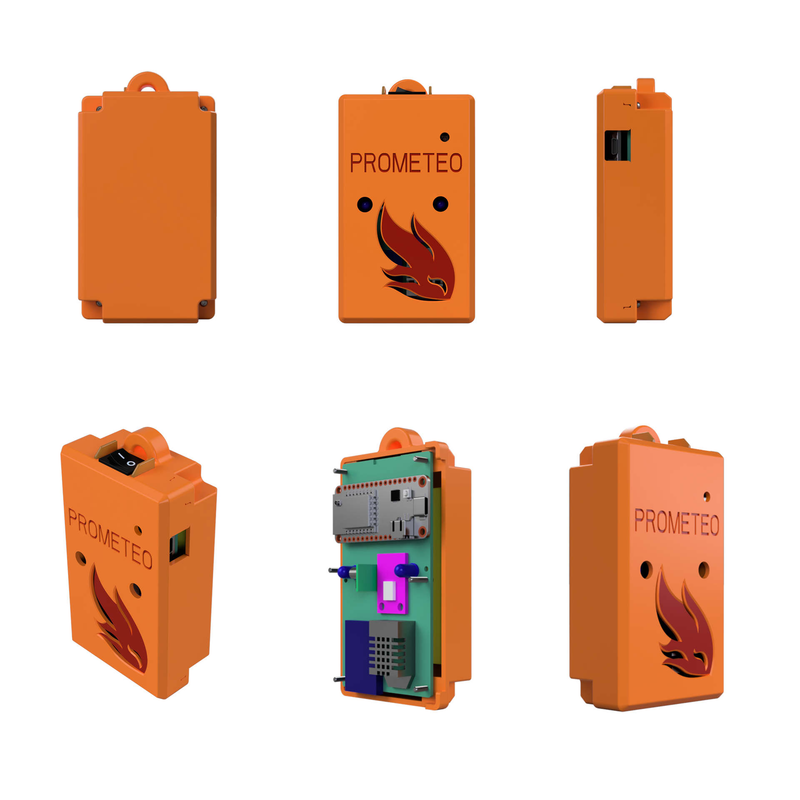

# Clamshell case design

This is the v2 case design that encloses battery, uses local storage, connects to the smartphone via Bluetooth Low Energy, and includes visual indicators.

## Initial case design

[3D STP file](case/Prometeo_2020_11_28.step)

Case Bottom [3D STL Bottom](case/Prometeo_2020_11_28_bottom.stl)
Case Top [3D STL file](case/Prometeo_2020_11_28_top.stl)

