# Prototype build instructions

## Hardware

- ESP32 Feather Board
- Temperature/Humidity sensor (DHT22)
- CO/NO2 sensor (CJMCU-4514)
- Lipo Battery
- MicroSD Reader
- MicroSD Card
- MicroUSB cable (Please ensure it is a data cable, not just a power cable)
- Female-to-Female Jumper wires

## Part 1: Installing the required software

This section will guide you through installing the prerequisite software on your machine.

1. Download the [Arduino IDE](https://www.arduino.cc/en/Main/Software) for your operating system.

1. Follow the [ClusterDuck-Protocol](https://github.com/ClusterDuck-Protocol/ClusterDuck-Protocol/wiki/software) instructions (#1-3) to install ESP32 core libraries:

1. Connect the ESP32 Feather to computer via USB cable. Verify that the USB to UART bridge is installed correctly:

   - Windows: check in Device Manager for Windows

     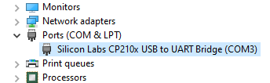

   - macOS: check in the Terminal for Mac `ls /dev/tty.*`

     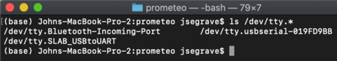

## Part 2: ESP32 WiFi Connectivity

This section will guide you in connecting your ESP32 to a local WiFi network.

1. Connect your ESP32 Feather to your computer via USB cable.

1. Follow [these instructions and perform the WifiScan](https://randomnerdtutorials.com/installing-the-esp32-board-in-arduino-ide-windows-instructions/) to make sure you have all the libraries and your connection is good.

## Part 3: Check Polarity of LiPo Battery

This section will guide you in verifying the correct polarity of the LiPo battery.

1. Check the polarity of the battery unit on the ESP32

   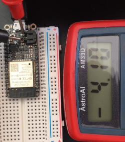

1. Check the polarity of the Lipo Battery using a multimeter. If it is negative, then you have to invert the wires in the JST connector.

   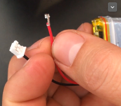

How-to Videos:

- How to [quickly determine the polarity](https://www.youtube.com/watch?v=xoUHbf_bRxw) of your DC power supply with a multimeter
- [Reverse polarity](https://www.youtube.com/watch?v=mvnf8phaPOY)
- Video for [testing and swapping leads](https://youtu.be/BtlHtQD7auI)

## Part 4: ESP32 Featherboard Pinout Diagram

[Pinout diagram](https://learn.adafruit.com/adafruit-huzzah32-esp32-feather/pinouts)

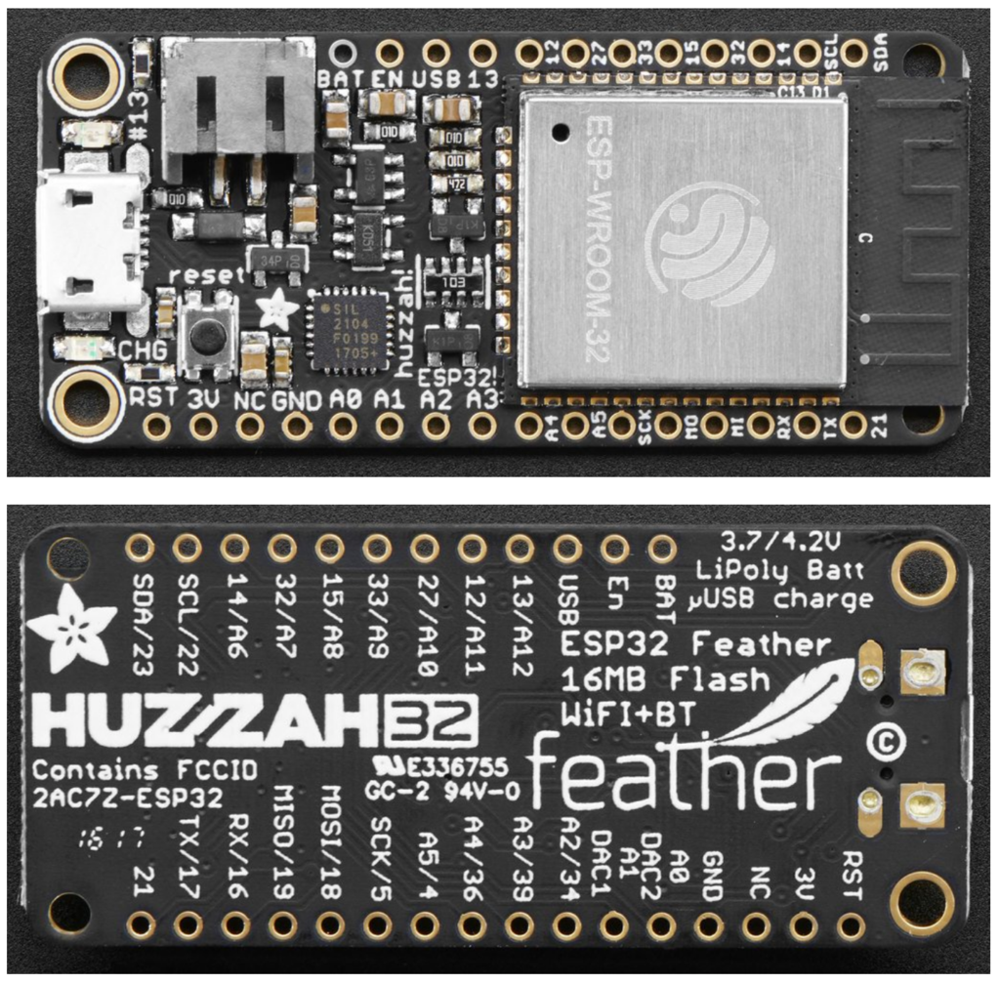

## Part 5: DHT22 Temperature / Humidity Test App

1. To install a library into the Arduino IDE you can use the Library Manager. From the menu select **Sketch** -> **Include Library** -> **Manage Libraries** to bring up the **Library Manager**.

   - For the ESP32 Featherboard, search and install the **DHT sensor library for ESPx** (by beegee_tokyo).
   - Adafruit have introduced a unified model to many of their sensor libraries, including the DHT library, and to use them you need to install the **Adafruit Unified Sensor** library, so search for it, it will appear at the bottom of the list, then install it.
   - When both of the libraries have been installed, click **close** to close the library manager.

1. Wire the DHT22 sensor onto the breadboard as follows:

- Pinout connecting Temperature/Humidity --> Feather
  - (-) --> GND
  - Out --> 27 (this could be any GPIO input)
  - (+) --> 3v
- To come: Instructions for PCB.

  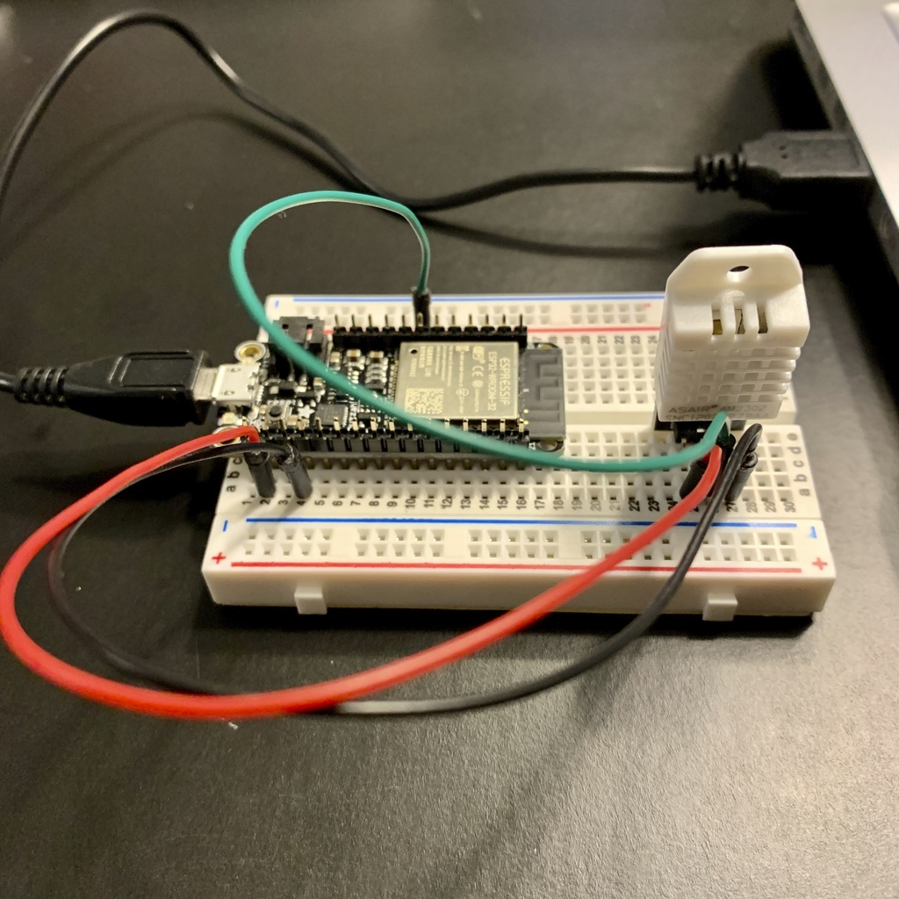

1. Download [sketch_DHT22_Sensor](https://github.com/Pyrrha-Platform/Pyrrha-Firmware/tree/master/september-prototypes/sketch_DHT22_Sensor) sketch code. Open the code in Arduino IDE and click the **Upload** button. Wait for it to compile, upload and print the "Hard resetting via RTS pin..." message.

1. In the Arduino IDE menu, open **Tools** -> **Serial Monitor**

   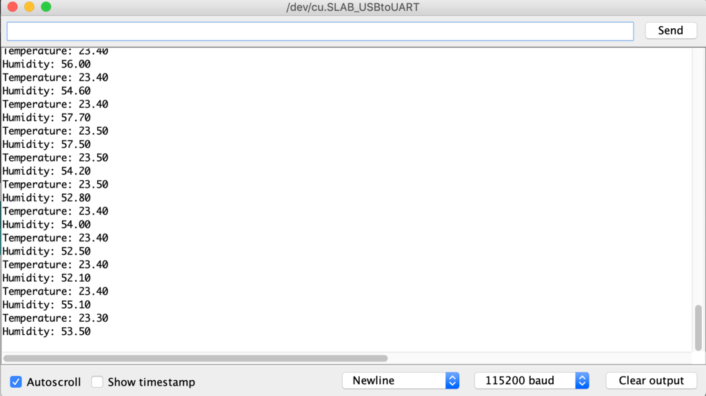

1. Bask in the warm sunlight of temperature and humidity readings coming from your DHT22.

   - You can change the humidity by breathing on the sensor

   - You can change the sensor readings from "every 10 seconds" to "every 0.5 seconds" in the sketch code by changing `delay(10000);` to `delay(500);`

## Part 6: NeoPixel RGB LEDs Test App

1. To install a library into the Arduino IDE you can use the Library Manager. From the menu select **Sketch** -> **Include Library** -> **Manage Libraries** to bring up the Library Manager.

   - In the search box enter **NeoPixel** to find libraries matching the search. You can see there are a number of libraries available, but you want to find the Adafruit NeoPixel by Adafruit, then select the entry and click install to install the library.

   - When both of the libraries have been installed, click **Close** to close the library manager.

1. Wire the RGB LED onto the breadboard as follows:

   - Pinout connecting LED --> Feather
   - Data in --> A0 / GIPO 26 (Could be any GPIO Output)
   - +5v --> 3v (I do not think 5v is necessary)
   - Ground --> GND
   - Data out --> No Connect

   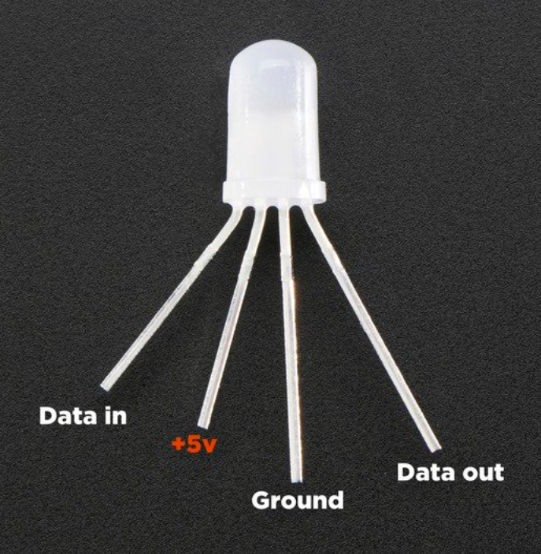

   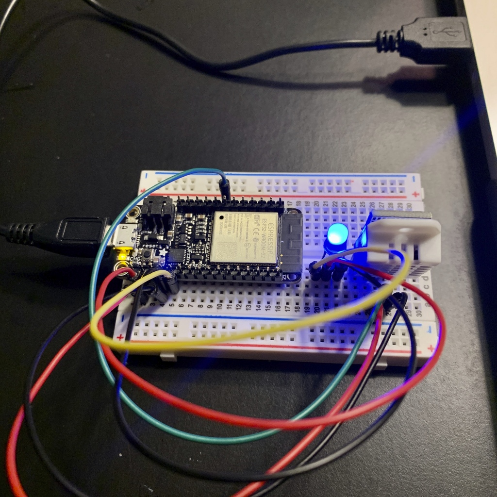

1. Download [sketch_RGBWstrandtest](https://github.com/Pyrrha-Platform/Pyrrha-Firmware/tree/master/september-prototypes/sketch_RGBWstrandtest) sketch code. Open the code in Arduino IDE and click the **Upload** button. Wait for it to compile, upload and print the "Hard resetting via RTS pin..." message.

1. The LED should cycle through Green, Red, Blue, Yellow colors, followed by Rainbow colors fade to white.

Troubleshooting:
If the LED remains a solid color, in the Arduino IDE menu, open **Tools** -> **Serial Monitor**.  If you see this error: "E (38264) gpio: gpio_set_level(176): GPIO output gpio_num error", make sure the LED_PIN in the Arduino code is set to the GPIO number corresponding to the "Data In" pin. In the above example, use 26 instead of A0.

## Part 7: Micro SD Reader

George's Preliminary Pinout:

- Micro SD Reader --> Feather
  - GND --> GND
  - VCC --> USB (This does need 5v, eventually I will add a step up for it from 3v)
  - MISO --> MI
  - MOSI --> MO
  - SCK --> SCKar
  - CS --> 33 (I found something online that mentioned this, I am guessing other options are out there)

There are built-in SD card tests in Arduino ID as well. **File** > **Examples** > **SD** > **ReadWrite** is a good basic test.

1. Download [SD_Test](https://github.com/Pyrrha-Platform/Pyrrha-Firmware/tree/master/september-prototypes/SD_Test) sketch code.. Open the code in Arduino IDE and click the **Upload** button. Wait for it to compile, upload and print the "Hard resetting via RTS pin..." message.

1. In the Arduino IDE menu, open **Tools** -> **Serial Monitor**

   - On my Mac (and I think on Vince's), I get a **Card Mount Failed** error. The error comes from one of the first lines of code - `SD.begin()`. Googling it, it seems that API takes an optional CS pin parameter that allows you to specify which ESP32 pin is wired to the “CS” pin on the SD card. From the wiring above, that’s 33, but doing `SD.begin(33)` makes no difference, so I’m not sure if I’m doing that right? --JS

   - I get the same error. I thought maybe we had to format the SD card into FAT16 or FAT32 format, but George/Laura didn't seem to have to format the card for it to work. -- VSS

   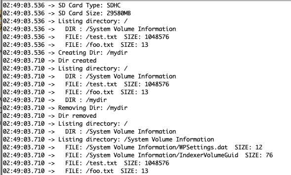

## Part 8: Bluetooth Test

Download George's testing sketch [Bluetooth Test code](https://github.com/Pyrrha-Platform/Pyrrha-Firmware/tree/master/september-prototypes/BLE-OK) Open it in the Arduino IDE and click the 'Upload' button. Wait for it to compile, upload and print the "Hard resetting via RTS pin..." message.

1. Open Bluetooth Preferences on your computer and look for "ESP32"

1. Connect to ESP32 via bluetooth

1. In Arduino IDE menu, change the Port by opening **Tools** -> **Port** -> "/dev/cu.ESP32-ESP32SPP". Open **Tools** -> **Serial Monitor** to see "Hello World" message.

   - Note: Laura couldn't get this port to show up? Not sure if missing a library or something, but the BLE test worked fine with my phone

   - The BLE also works fine with the Mac.  The port above is for the Mac.  I believe for PC, it's a COM port? Maybe we do need to separate instructions based on Mac vs. Windows. --VSS

1. Plug in LiPo Battery to set-up and try disconnecting USB from computer. Check that the "Hello World" message continues to show.

BLE Test

1. Upload the [BLE-OK](https://github.com/Pyrrha-Platform/Pyrrha-Firmware/tree/master/september-prototypes/BLE-OK) sketch to your ESP32

1. You can scan your ESP32 BLE server with your smartphone and see its services and characteristics. For that, we’ll be using a free app called nRF Connect for Mobile from Nordic, it works on Android ([Google Play Store](https://play.google.com/store/apps/details?id=no.nordicsemi.android.mcp)) and iOS ([App Store](https://apps.apple.com/us/app/nrf-connect/id1054362403)). Go to Google Play Store or App Store and search for “nRF Connect for Mobile”. Install the app and open it.

1. In your phone, find the Prometeo device and connect to it.

## Part 9: CO/NO Sensor Sample App

George's Preliminary Pinout:

- CO/NO Sensor --> Feather
  - VCC --> USB
  - GND --> GND
  - RED --> 36/A4 --> I switched this to 39/A3 for ease of wiring
  - NOX --> 39/A3 --> I switched this to 36/A4 for ease of wiring
  - PRE --> 14

CO/NO Sensor Test

1. Download [MICS-4514-Test](https://github.com/Pyrrha-Platform/Pyrrha-Firmware/tree/master/september-prototypes/MICS-4514-Test) sketch code. Open the code in Arduino IDE and click the 'Upload' button. Wait for it to compile, upload and print the "Hard resetting via RTS pin..." message.

   - I had to match the baud rate to get the script to work - i.e. change the line `Serial.begin(9600);` to `Serial.begin(115200);` After that, it worked like a charm --JS

1. In the Arduino IDE menu, open Tools -> Serial Monitor

   - Bask in the warm sunlight of **Vnox** and  **Vred** values from your MICS-4514 that aren't changing, because you're not on fire! 😃 🔥
   - Marco - I burned something... now I got some readings...

     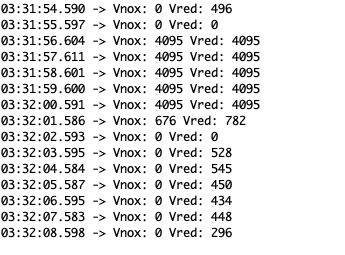
